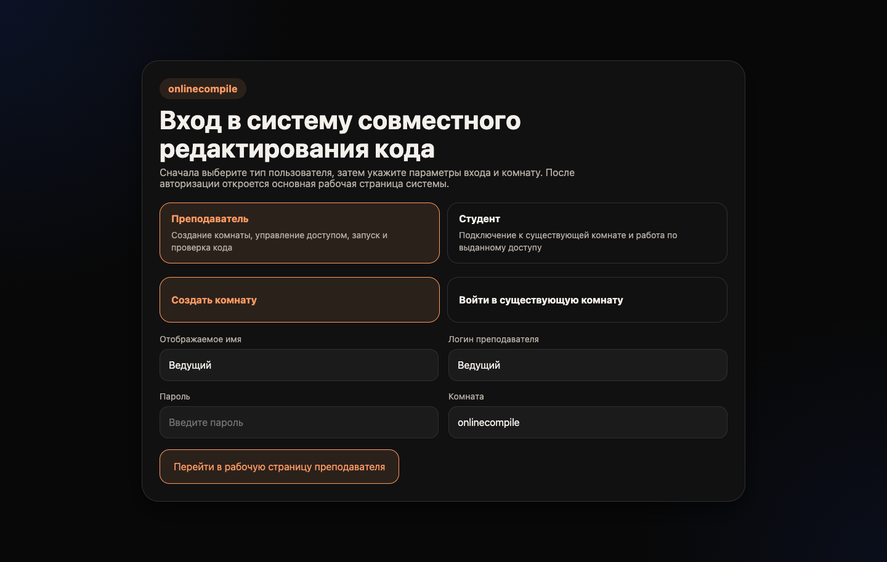
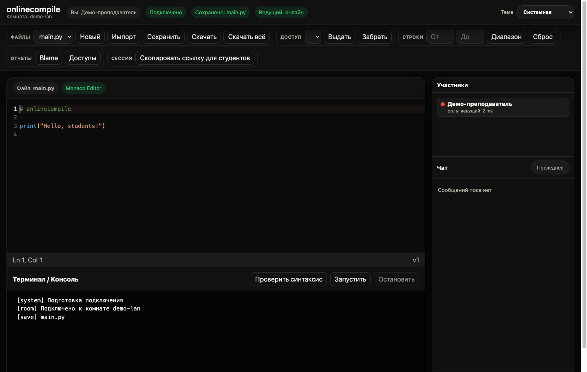
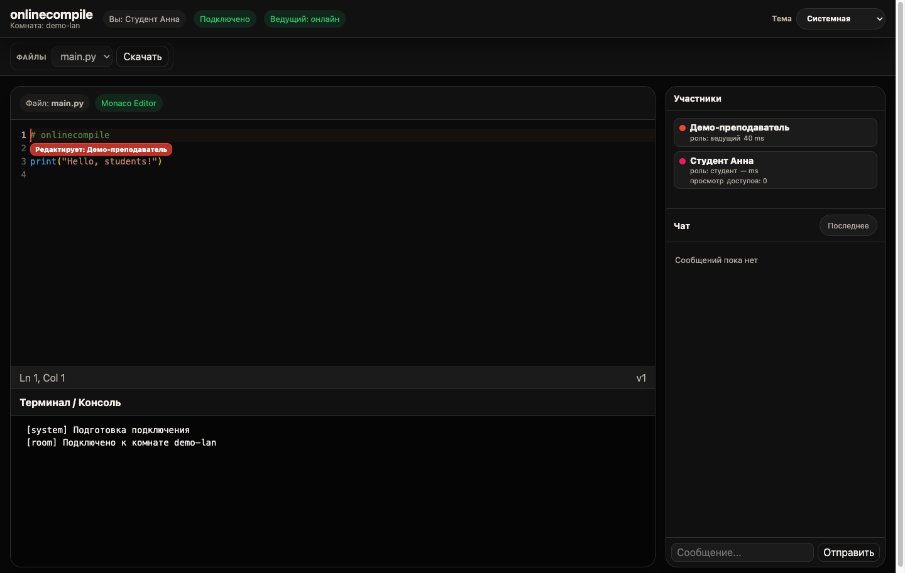

# onlinecompile

Локальная система совместного редактирования Python-кода для занятий: преподаватель создаёт комнату, студенты заходят к ней через браузер в одной локальной сети, а документ синхронизируется в реальном времени.







## Возможности

- комнаты с учётной записью преподавателя и гостевым входом студентов;
- синхронизация изменений, курсоров, участников и чата через WebSocket;
- выдача одному студенту права редактирования и ограничение диапазоном строк;
- Monaco Editor, подсказки Python, синтаксическая проверка и темы оформления;
- запуск кода преподавателем с тайм-аутом, ограничением ресурсов и остановкой процесса;
- файлы комнаты: новый файл, импорт, явное сохранение, скачивание файла или ZIP-архива;
- личные сохранения студентов, отчёты по авторам строк и выдачам доступа;
- кнопка «Скопировать ссылку для студентов»: создаёт готовое приглашение с именем комнаты и адресом локальной сети.

## Быстрый запуск — macOS и Windows

Нужен Python **3.11 или новее** и подключение к интернету только для первого запуска, чтобы установить зависимости.

- macOS: дважды откройте [deploy/run_macos.command](deploy/run_macos.command). Если macOS блокирует файл, нажмите правой кнопкой → «Открыть» → «Открыть».
- Windows: дважды откройте [deploy/run_windows.bat](deploy/run_windows.bat). Если появится запрос брандмауэра, разрешите доступ только для **частных сетей**.

Скрипты сами создают изолированное окружение `.venv`, устанавливают нужные пакеты и запускают сервер. Не закрывайте окно терминала: пока оно открыто, занятие доступно. В нём появятся адреса вида `http://192.168.x.x:8000` — именно такой адрес должны открыть студенты, подключённые к той же Wi‑Fi/Ethernet сети.

После входа преподавателя используйте кнопку **«Скопировать ссылку для студентов»**: она поместит в буфер полностью готовую ссылку с комнатой. Если преподаватель сам открыл `127.0.0.1`, скопируйте показанный в терминале LAN-адрес, а не `127.0.0.1`.

## Вариант без установки Python: Docker Desktop

На macOS и Windows можно запустить проект через Docker Desktop:

```bash
docker compose -f deploy/compose.yaml up --build
```

Откройте `http://localhost:8000` на компьютере преподавателя или `http://<LAN-IP-преподавателя>:8000` на устройствах студентов. Данные занятий хранятся в локальной папке `room_data/`; не удаляйте её, если требуется сохранить работы.

## Учётная запись преподавателя

В `config.json` хранятся логины и bcrypt-хеши паролей. Пароль не записывается в открытом виде. Текущий файл конфигурации намеренно не меняется при обновлении проекта.

Чтобы задать известный пароль, сгенерируйте его хеш:

```bash
poetry run python server.py --hash-password "Новый надёжный пароль"
```

Затем замените соответствующую запись в `config.json`:

```json
{
  "hosts": [
    {
      "username": "teacher",
      "password_hash": "вставьте_сгенерированный_bcrypt_хеш"
    }
  ]
}
```

Если `config.json` отсутствует, для первоначального локального ознакомления действует временная учётная запись `HOST` / `Example1`. Перед использованием в сети обязательно создайте собственный пароль и файл конфигурации.

## Обычный запуск для разработки

```bash
poetry install --with dev
poetry run python server.py
```

Для автоматической перезагрузки исходного кода во время разработки:

```bash
ONLINECOMPILE_RELOAD=1 poetry run python server.py
```

## Проверка качества

```bash
poetry run pytest -q
node --check static/app.js
```

Тесты проверяют авторизацию и WebSocket-сценарий, ограничения размера и путей файлов, синхронизацию патчей, остановку бесконечного цикла и запрет опасных импортов. Изменения интерфейса дополнительно проверены в браузере на экранах входа, преподавателя и студента.

## Важные ограничения безопасности

Приложение рассчитано на доверенную учебную локальную сеть, а не на публичный интернет. Оно не должно быть опубликовано наружу без HTTPS, полноценной авторизации студентов, журналирования и отдельной песочницы.

Код запускается в отдельном процессе с тайм-аутом и ограничениями. Разрешены только безопасные стандартные учебные модули (например, `math`, `random`, `statistics`, `json`); сетевые и системные модули, включая `asyncio`, `socket`, `subprocess`, `os`, запрещены. Это уменьшает риск, но не заменяет изоляцию уровня Docker/rootless-контейнера, gVisor, nsjail или отдельной VM для недоверенного кода.

Студенты могут войти только в активную комнату или во время пятиминутного окна переподключения преподавателя. Сохранённая после перезапуска сервера комната открывается сначала только преподавателем — это предотвращает доступ к старым работам по известному имени комнаты.

## Структура

```text
server.py                 сервер FastAPI и WebSocket-логика
static/                   интерфейс и локальная сборка Monaco Editor
docs/screenshots/         скриншоты интерфейса для этого README
config.json               учётные записи преподавателей (bcrypt-хеши)
room_data/                созданные комнаты и сохранённые работы
deploy/                   отдельные файлы запуска и контейнеризации
  run_macos.command       запуск двойным кликом в macOS
  run_windows.bat         запуск двойным кликом в Windows
  Dockerfile              образ Docker
  compose.yaml            запуск через Docker Desktop
  requirements.txt        зависимости для самостоятельного запуска
```
